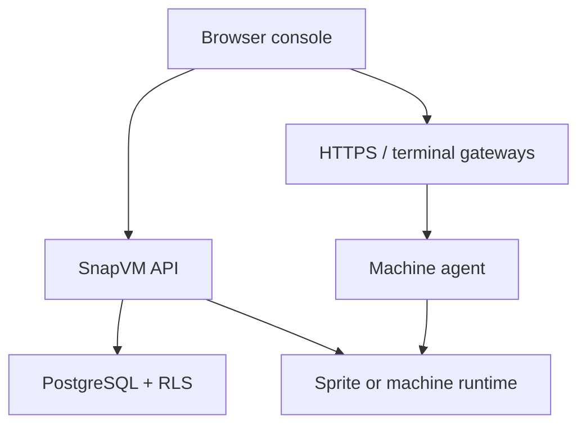

import { Card, CardGrid } from "@astrojs/starlight/components";

SnapVM provides isolated development workspaces powered by [Sprites](https://docs.sprites.dev/): persistent cloud containers that keep their filesystem, packages, and configuration across hibernation. Each workspace gives you a full Linux environment with browser access to a terminal, editor, and HTTP services without asking every developer to run local infrastructure.

Organizations, users, and access are managed in the SnapVM web console. Machines can hibernate when idle and wake when you reconnect, so teams keep useful state without keeping every workspace hot all day.

SnapVM currently focuses on the web console and HTTP API. It does not ship a standalone SnapVM CLI or MCP server, so this documentation does not describe those flows.

## What SnapVM provides

<table>
  <thead>
    <tr>
      <th>Capability</th>
      <th>Typical disposable sandboxes</th>
      <th>SnapVM</th>
    </tr>
  </thead>
  <tbody>
    <tr>
      <td>Workspace state</td>
      <td>Often reset between runs</td>
      <td>Persistent filesystem, packages, repositories, and configuration</td>
    </tr>
    <tr>
      <td>Terminal access</td>
      <td>One-off attach sessions</td>
      <td>Browser terminal over WebSocket PTY with reconnect support</td>
    </tr>
    <tr>
      <td>Editor access</td>
      <td>Bring your own editor</td>
      <td>Code Server on the workspace when enabled by the deployment</td>
    </tr>
    <tr>
      <td>HTTP access</td>
      <td>Custom tunnels or VPNs</td>
      <td>Per-machine HTTPS URL routed by the platform gateway</td>
    </tr>
    <tr>
      <td>Isolation</td>
      <td>Shared or provider-specific</td>
      <td>Dedicated machine runtime with organization-scoped data access</td>
    </tr>
    <tr>
      <td>Idle behavior</td>
      <td>Cold start from scratch</td>
      <td>Hibernate while preserving durable state</td>
    </tr>
  </tbody>
</table>

## Core concepts

### Machines

A machine is the SnapVM workspace you create and manage from the console. It has a name, lifecycle state, size, region, runtime type, and gateway URLs.

### Sprites runtime

Machines can be backed by Sprites, which provide persistent cloud containers with fast hibernation and wake-up. SnapVM uses that runtime as the durable execution layer while the SnapVM control plane handles authentication, organization membership, machine records, and gateway routing.

### Terminal sessions

Each machine runs an agent that exposes terminal sessions to the console. Browser disconnects do not need to end a terminal session immediately; reconnecting can attach to the same session and replay recent output.

### Services

Services are persistent process definitions for web servers, databases, agents, or workers that should restart when a machine wakes. They are better than leaving long-running processes in an interactive shell.

## Architecture at a glance

The web console is the main user surface. The API server authorizes requests, enforces organization boundaries, and coordinates machine lifecycle. Gateways route browser traffic to terminals and applications running inside machines.

## Next steps

<CardGrid>
  <Card title="Quickstart" icon="rocket" href="/quickstart">
    Create a machine from the console, open a terminal, and run your first
    process.
  </Card>
  <Card title="Working with SnapVM" icon="setting" href="/working-with-snapvm">
    Learn how machines, sessions, services, and hibernation fit together.
  </Card>
  <Card title="Machines" icon="server" href="/concepts/machines">
    Understand machine states, naming, runtime types, and gateway URLs.
  </Card>
</CardGrid>
