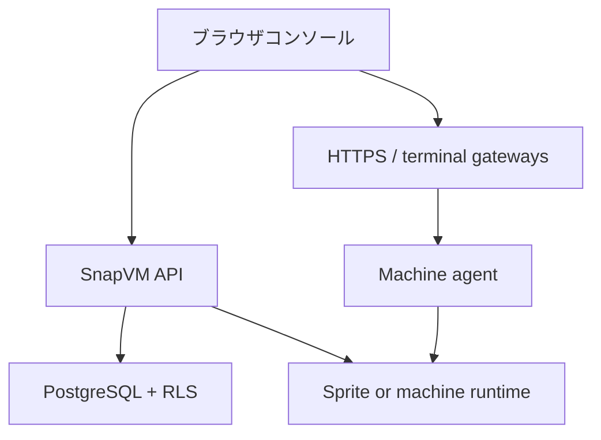

import { Card, CardGrid } from "@astrojs/starlight/components";

SnapVM は [Sprites](https://docs.sprites.dev/) を基盤に、隔離された開発ワークスペースを提供します。Sprites はファイルシステム、パッケージ、設定をハイバネーション後も保持する永続クラウドコンテナです。開発者はローカルのインフラを用意せずに、ブラウザから Linux 環境、ターミナル、エディタ、HTTP サービスへアクセスできます。

組織、ユーザー、アクセス権は SnapVM の Web コンソールで管理します。マシンはアイドル時にハイバネーションし、再接続時に復帰できるため、チームは状態を保ったままコンピュートの稼働時間を抑えられます。

SnapVM は現在、Web コンソールと HTTP API を中心に提供されています。スタンドアロンの SnapVM CLI や MCP サーバーは提供していないため、このドキュメントではそれらの手順は扱いません。

## SnapVM が提供するもの

<table>
  <thead>
    <tr>
      <th>機能</th>
      <th>一般的な使い捨てサンドボックス</th>
      <th>SnapVM</th>
    </tr>
  </thead>
  <tbody>
    <tr>
      <td>ワークスペースの状態</td>
      <td>実行ごとにリセットされがち</td>
      <td>ファイルシステム、パッケージ、リポジトリ、設定を永続化</td>
    </tr>
    <tr>
      <td>ターミナル</td>
      <td>一時的な attach セッション</td>
      <td>WebSocket PTY によるブラウザターミナルと再接続</td>
    </tr>
    <tr>
      <td>エディタ</td>
      <td>各自で用意</td>
      <td>デプロイで有効な場合はワークスペース上の Code Server</td>
    </tr>
    <tr>
      <td>HTTP アクセス</td>
      <td>トンネルや VPN を個別に用意</td>
      <td>
        マシンごとの HTTPS URL をプラットフォームゲートウェイでルーティング
      </td>
    </tr>
    <tr>
      <td>隔離</td>
      <td>共有またはプロバイダ依存</td>
      <td>専用ランタイムと組織単位のデータアクセス</td>
    </tr>
    <tr>
      <td>アイドル時</td>
      <td>ゼロからコールドスタート</td>
      <td>永続状態を保ってハイバネーション</td>
    </tr>
  </tbody>
</table>

## 主要な概念

### マシン

マシンは、コンソールから作成・管理する SnapVM ワークスペースです。名前、ライフサイクル状態、サイズ、リージョン、ランタイム種別、ゲートウェイ URL を持ちます。

### Sprites ランタイム

マシンは Sprites をランタイムとして利用できます。SnapVM はこの永続的な実行レイヤーを使い、認証、組織メンバーシップ、マシンレコード、ゲートウェイルーティングをコントロールプレーンで管理します。

### ターミナルセッション

各マシンではエージェントがターミナルセッションを公開します。ブラウザを閉じてもすぐにセッションが失われるわけではなく、再接続して直近の出力を確認できます。

### サービス

サービスは、マシン復帰時に再起動すべきプロセスを定義する仕組みです。Web サーバー、データベース、エージェント、ワーカーなど、インタラクティブシェルに置きっぱなしにしたくないプロセスに使います。

## アーキテクチャ概要

主なユーザー接点は Web コンソールです。API サーバーはリクエストを認可し、組織境界を守り、マシンのライフサイクルを調整します。ゲートウェイはブラウザからのターミナル通信やアプリケーション通信をマシン内へルーティングします。

## 次のステップ

<CardGrid>
  <Card title="クイックスタート" icon="rocket" href="/ja/quickstart">
    コンソールでマシンを作成し、ターミナルを開いて最初のプロセスを動かします。
  </Card>
  <Card title="SnapVM の使い方" icon="setting" href="/ja/working-with-snapvm">
    マシン、セッション、サービス、ハイバネーションの関係を確認します。
  </Card>
  <Card title="マシン" icon="server" href="/ja/concepts/machines">
    マシンの状態、命名、ランタイム種別、ゲートウェイ URL を理解します。
  </Card>
</CardGrid>
